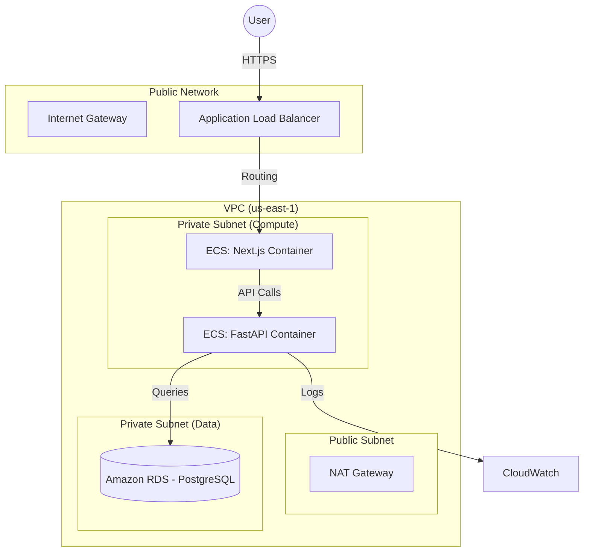
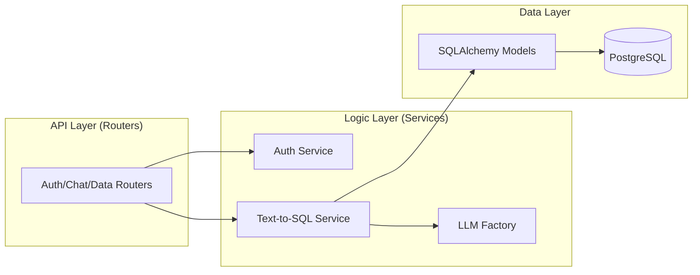
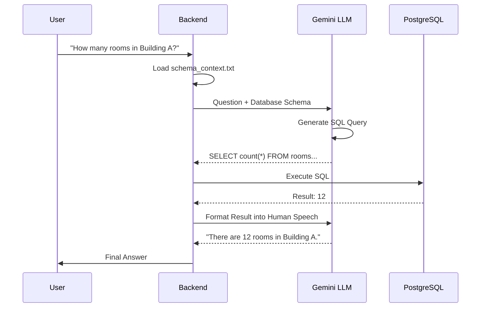

# 🏗 Campus Smart Assistant Architecture

This document provides a technical deep dive into the infrastructure and software design of the Campus Smart Assistant.

---

## 1. Cloud Infrastructure (AWS)
This diagram showcases how the system is deployed using **Terraform**. It focuses on network isolation and container orchestration.

### Key Components:
*   **ALB (Load Balancer):** The single entry point for all traffic. It handles SSL termination and routes traffic to the appropriate ECS service.
*   **ECS Fargate:** Serverless container execution. The Frontend (Next.js) and Backend (FastAPI) run in private subnets for maximum security.
*   **RDS (PostgreSQL):** A managed database hidden in a deep private subnet, accessible only by the Backend container.
*   **NAT Gateway:** Allows containers in private subnets to reach the internet (e.g., to call the Gemini API) without being exposed to incoming attacks.

---

## 2. Software Architecture (FastAPI Design)
This diagram explains the internal organization of the **Python Backend**, following the **Controller-Service-Repository** pattern.

### Design Patterns:
*   **Routers (Controllers):** Located in `backend/routers/`. They handle HTTP parsing and input validation.
*   **LLM Factory:** A pattern used in `services/llm/` that allows the system to switch between **Google Gemini** and **OpenAI** dynamically based on environment variables.
*   **RAG (Retrieval-Augmented Generation):** The bridge between natural language and structured data.

---

## 3. The AI RAG Flow (Text-to-SQL)
The most critical logic in the project. This sequence shows how a human question becomes a database result.

### Why this is powerful:
*   **Deterministic Data:** The AI doesn't "guess" the answer; it retrieves it from your real-time academic database.
*   **Context Aware:** By feeding the schema context (`prompts/schema_context.txt`) to the LLM, the system knows exactly which tables and columns to query.

---

## 4. Security & Authentication
*   **Password Security:** All passwords are salted and hashed using **BCrypt** before entering the database.
*   **Stateless Auth:** Uses **JWT (JSON Web Tokens)**. Once a user logs in, the backend doesn't need to "remember" them; the token contains their role (Student/Admin) securely signed.
*   **Infrastructure Security:** Managed via AWS Security Groups, ensuring the Database only talks to the Backend, and the Backend only talks to the Load Balancer.
